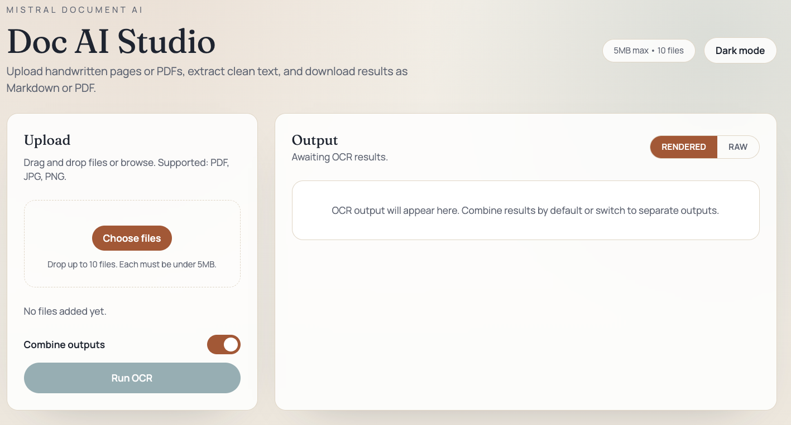

# Doc AI OCR Demo

Example FastAPI + React app that shows how to run Mistral Document AI (Azure Foundry deployment) on PDFs and images, then view or download the extracted text.

This demo is built around Microsoft Foundry, where you can deploy the Mistral OCR model used here. Deploy the **mistral-document-ai-2505** model from the Foundry model catalog (https://ai.azure.com/catalog/models/mistral-document-ai-2505) and grab the endpoint + key from your deployment page. The API here expects the Foundry OCR-style endpoint (`/providers/mistral/azure/ocr`) and key.

## What the model does (mistral-document-ai-2505)
- Model card: https://ai.azure.com/catalog/models/mistral-document-ai-2505
- OCR for PDFs and images (expects base64 data URLs in the request).
- Returns text and per-page content; can include base64 images when requested.
- Supports schema-based extraction via `bbox_annotation_format` and `document_annotation_format` (JSON schema).
- Handles both PDF and image inputs via the `document` object (`type`: `document_url` for PDFs, `image_url` for images).
- Typical request limit shown in the portal: 60 requests per minute (adjust your backoff if needed).
- Supported languages: see the model catalog for the current list (multilingual OCR, Latin scripts and more). If you rely on a specific language, confirm in the catalog and validate with a sample doc.

### Why this model (quick comparison)
I built this repo because mistral-document-ai-2505 gives high-quality OCR and structured extraction out of the box. Here is a simple comparison for the common use cases I care about:

| Use case | Mistral Document AI 2505 | Legacy OCR (e.g., Tesseract) | Generic LLM w/ vision |
| --- | --- | --- | --- |
| Handwritten notes | Strong accuracy, handles messy handwriting better than classic OCR | Often misses strokes, weak on messy handwriting | Can read images but needs image uploads and prompt tuning |
| PDFs with mixed content | Reads text, handles multi-page; schema extraction available | Text-only, layout-aware but no schema extraction | Needs prompt engineering, higher latency |
| Schema/fields extraction | Built-in JSON schema via `document_annotation_format` or `bbox_annotation_format` | Not supported | Requires manual parsing of model output |
| API shape | Simple REST (data URL payload) with JSON | Simple text/image OCR only | Varies by provider; usually chat/completions style |
| Output quality | Returns clean text, page-level content, optional markdown | Raw text, little structure | Depends on prompt and provider limits |

If you want a turnkey OCR + structured extraction path with minimal prompt fuss, this model is a solid fit.

## What this app does
- Upload up to 10 files (PDF, PNG, JPG, JPEG), 5MB max each.
- Parallel OCR with retry/backoff to respect rate limits.
- Combine all outputs into one view by default, or switch to per-file view.
- Rendered vs raw toggle for the extracted content.
- Download Markdown or PDF (client-side render).
- Light/dark theme with Tailwind styling.

## UI preview


What’s on screen:
- Upload panel: drag/drop or browse, shows queued files with size/type and per-file removal, plus clear-all.
- Controls: combine vs per-file toggle, Run OCR button, inline error hints, and a light/dark theme toggle in the header.
- Output panel: rendered Markdown vs raw text toggle; combined view with Markdown/PDF downloads; per-file cards when combine is off, each with its own downloads and error state.

## Tech stack
- Backend: FastAPI, httpx (async), pydantic-settings.
- Frontend: React + Vite + TypeScript + Tailwind, react-markdown, html2pdf.js.
- Container: Dockerfiles for API and web, `docker-compose` for local orchestration.

## Prerequisites
- Python 3.11+
- Node 18+ (tested with Node 20) and npm
- Docker (optional, for containerized runs)

## Configuration
Create `.env` in the repo root (copy from `.env.example`):
```
AZURE_OCR_ENDPOINT=https://reuben-mistal-doc-ai-25-resource.services.ai.azure.com/providers/mistral/azure/ocr
AZURE_API_KEY=your_key_here
MISTRAL_MODEL=mistral-document-ai-2505
MAX_FILE_SIZE_MB=5
MAX_FILES=10
MAX_CONCURRENCY=3
REQUEST_TIMEOUT_S=60
AUTH_HEADER_STYLE=both   # options: both | bearer | api-key
CORS_ORIGINS=http://localhost:5173,http://127.0.0.1:5173
VITE_API_BASE_URL=http://localhost:8001
```

If the endpoint only accepts one header style, set `AUTH_HEADER_STYLE` to `api-key` or `bearer` accordingly.
If you deploy your own model instance in Foundry, update `AZURE_OCR_ENDPOINT` and `AZURE_API_KEY` to your deployment values.

## Run the API (dev)
```bash
cd apps/api
python -m venv .venv
source .venv/bin/activate
pip install -r requirements.txt
uvicorn app.main:app --reload --port 8001
```

## Run the web app (dev)
```bash
cd apps/web
npm install
npm run dev -- --host --port 5173
```
Open http://localhost:5173.

## Run with Docker
```bash
docker compose up --build
```
The compose file builds both images. Set `VITE_API_BASE_URL` in `.env` to the reachable API URL (`http://api:8000` in compose).

## How it works
- Frontend uploads files (multipart) to `/api/ocr`.
- Backend validates type/size, base64-encodes the file as a data URL, builds the payload (`document_url` for PDFs, `image_url` for images).
- Backend calls the Azure OCR endpoint with retries/backoff and whichever auth headers you configure.
- A parsing heuristic walks the response to pull `markdown` or `text`, falling back to page text or all string leaves if needed.
- Frontend shows rendered Markdown or raw text, and can export Markdown or a client-side PDF snapshot.

## Notes and troubleshooting
- 401 errors: verify the key and try switching `AUTH_HEADER_STYLE` (`both` → `api-key` or `bearer`). Restart the API after changing `.env`.
- CORS errors: update `CORS_ORIGINS` to include your dev host/port and restart the API.
- Large files: 5MB cap per file; adjust in `.env` if needed (and restart the API).
